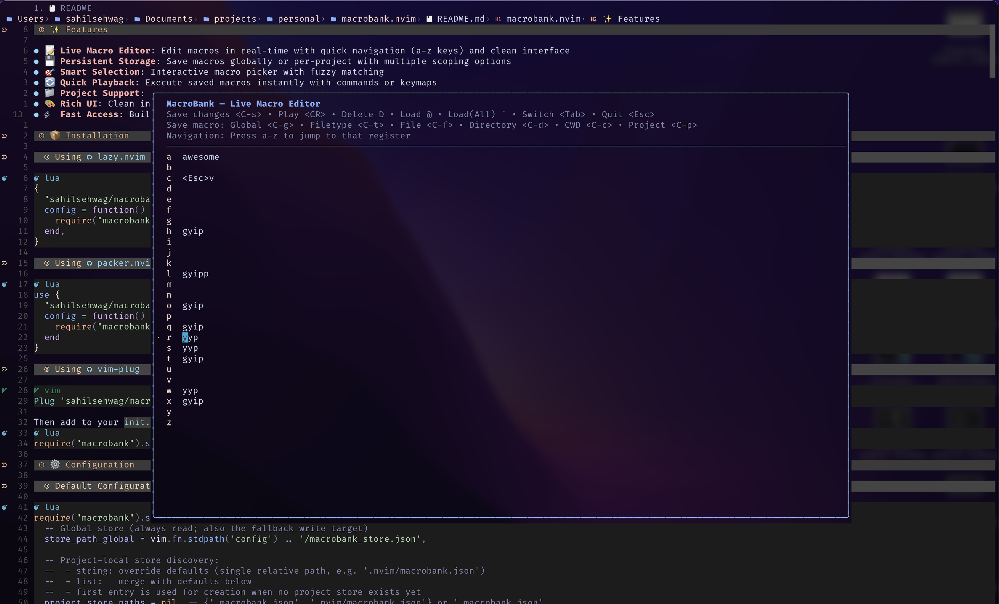
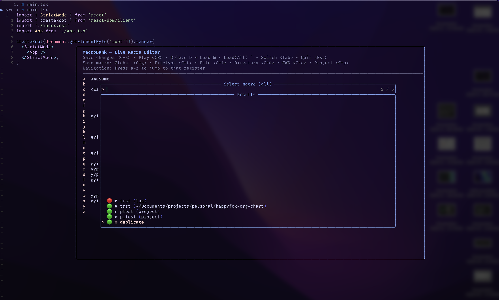
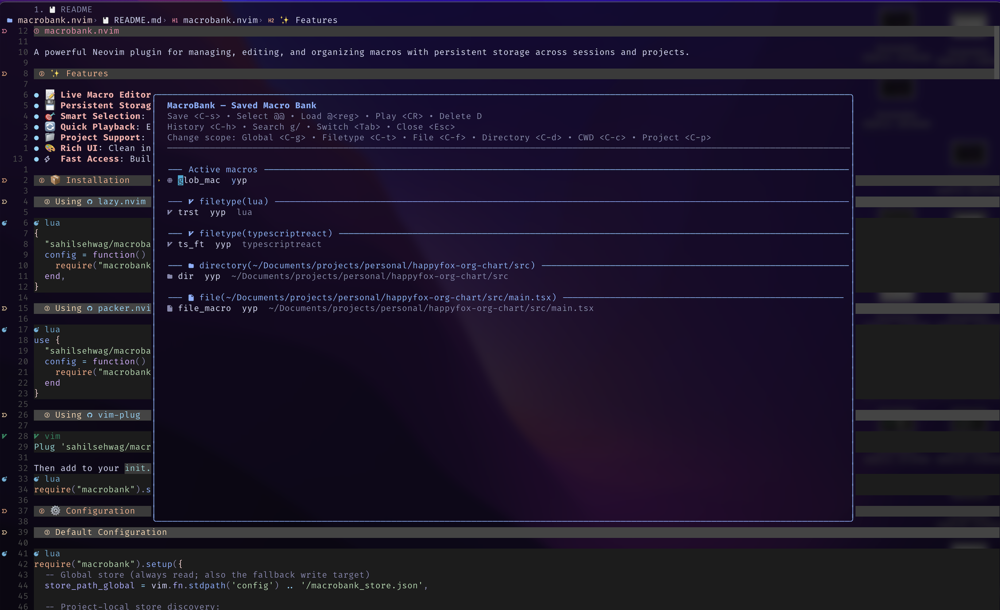
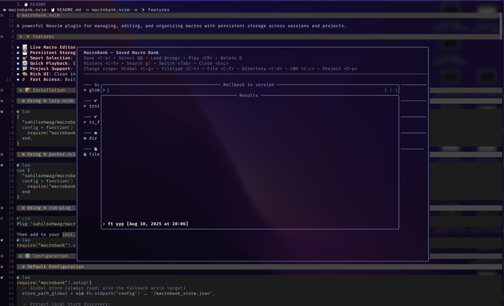

# macrobank.nvim

A powerful Neovim plugin for managing, editing, and organizing macros with persistent storage across sessions and projects.

<div align="center">
  


*Manage your macros with a clean, intuitive interface*

</div>

## ✨ Features

- 📝 **Live Macro Editor**: Edit macros in real-time with quick navigation (a-z keys) and clean interface
- 💾 **Persistent Storage**: Save macros globally or per-project with multiple scoping options
- 🎯 **Smart Selection**: Interactive macro picker with fuzzy matching
- 🔄 **Quick Playback**: Execute saved macros instantly with commands or keymaps
- 📁 **Project Support**: Automatic project-local macro discovery
- 🎨 **Rich UI**: Clean interface with Nerd Font icons (optional)
- ⚡ **Fast Access**: Built-in commands and customizable key mappings

## 📸 Screenshots

<div align="center">

### Live Macro Editor
Edit macros in real-time with quick navigation and clean interface


### Smart Macro Picker  
Interactive macro selection with emoji status indicators and scope information


### Saved Macro Bank
Manage your saved macros organized by scope with rich context information


### Macro History & Versioning
View and rollback to previous versions of your macros


</div>

## 📦 Installation

### Using [lazy.nvim](https://github.com/folke/lazy.nvim)

```lua
{
  "sahilsehwag/macrobank.nvim",
  config = function()
    require("macrobank").setup()
  end,
}
```

### Using [packer.nvim](https://github.com/wbthomason/packer.nvim)

```lua
use {
  "sahilsehwag/macrobank.nvim",
  config = function()
    require("macrobank").setup()
  end
}
```

### Using [vim-plug](https://github.com/junegunn/vim-plug)

```vim
Plug 'sahilsehwag/macrobank.nvim'
```

Then add to your `init.lua`:
```lua
require("macrobank").setup()
```

## ⚙️ Configuration

### Default Configuration

```lua
require("macrobank").setup({
  -- Global store (always read; also the fallback write target)
  store_path_global = vim.fn.stdpath('config') .. '/macrobank_store.json',

  -- Project-local store discovery:
  --  - string: override defaults (single relative path, e.g. '.nvim/macrobank.json')
  --  - list:   merge with defaults below
  --  - first entry is used for creation when no project store exists yet
  project_store_paths = nil, -- {'.macrobank.json', '.nvim/macrobank.json'} or '.macrobank.json'

  default_select_register = 'q',  -- register to load selected macro into
  default_play_register   = 'q',  -- temporary register used to play from bank
  nerd_icons = true,              -- use nerdfont icons in UI labels

  window = {                     -- editor window dimensions
    width  = 0.7,                -- fraction of columns or absolute number
    height = 0.7,                -- fraction of lines   or absolute number
  },

  -- Editor buffer mappings override (optional)
  live_editor_mappings = {},      -- override live editor buffer mappings: {action_name = 'keymap' | false}
  bank_editor_mappings = {},      -- override bank editor buffer mappings: {action_name = 'keymap' | false}
})
```

### Custom Configuration Example

```lua
require("macrobank").setup({
  -- Use larger editor window
  window = {
    width = 0.8,
    height = 0.8,
  },
  
  -- Custom project store paths
  project_store_paths = {'.macros.json', '.config/macros.json'},
  
  -- Different default registers
  default_select_register = 'x',
  default_play_register = 'y',
  
  -- Disable nerd font icons
  nerd_icons = false,
  
  -- Override editor buffer mappings (optional)
  live_editor_mappings = {
    save = '<leader>s',       -- change save key from <C-s> to <leader>s
    delete = false,           -- disable delete key entirely
    play = '<Space>',         -- change play key from <CR> to <Space>
  },
  bank_editor_mappings = {
    search = '/',             -- change search key from g/ back to /
    history = false,          -- disable history feature
    load = '<leader>l',       -- change load key from @ to <leader>l
  },
})
```

## 🚀 Usage

### Commands

| Command | Description |
|---------|-------------|
| `:MacroBankLive` | Open the Live Macro Editor to view/edit current registers |
| `:MacroBank` | Open the Macro Bank to manage saved macros |
| `:MacroBankSelect [name]` | Load a macro into the default register (interactive picker if no name) |
| `:MacroBankSelect! [name]` | Same as above but shows all scopes |
| `:MacroBankPlay [name]` | Execute a macro directly (interactive picker if no name) |
| `:MacroBankPlay! [name]` | Same as above but shows all scopes |


### Keymaps

You can set up your own keymaps to open the Live Macro Editor or Macro Bank using `vim.keymap.set` or `vim.cmd`.

**Using `vim.keymap.set` (recommended):**

```lua
vim.keymap.set('n', '<leader>mm', function() require('macrobank.editor').open() end, { desc = '[Macrobank]: Edit macros' })
vim.keymap.set('n', '<leader>mb', function() require('macrobank.bank_editor').open() end, { desc = '[MacroBank] Edit saved macros' })
```

**Using `vim.cmd`:**

```lua
vim.keymap.set('n', '<leader>mm', ':MacroBankLive<CR>', { desc = '[Macrobank]: Edit macros' })
vim.keymap.set('n', '<leader>mb', ':MacroBank<CR>', { desc = '[MacroBank] Edit saved macros' })
```

### Live Macro Editor Keymaps

When in the Live Macro Editor (`:MacroBankLive`):

| Key | Action | Description |
|-----|--------|-------------|
| `<C-s>` | Save | Save the register under cursor with edited content |
| `<CR>` | Play | Execute the macro under cursor |
| `D` | Delete | Clear the macro register |
| `@` | Load | Load macro from picker (current context) into register under cursor |
| `` ` `` | Load (All) | Load macro from picker (all scopes) into register under cursor |
| `a-z` | Navigate | Jump directly to that register (e.g., `f` jumps to register f) |
| `<Tab>` | Switch | Toggle between register and saved macro views |
| `<Esc>` | Quit | Close the editor |

### Save Scopes (Live Editor)

When saving macros from the Live Editor:

| Key | Scope | Description |
|-----|-------|-------------|
| `<C-g>` | Global | Save macro under cursor to global macro store |
| `<C-t>` | Filetype | Save macro under cursor scoped to current filetype |
| `<C-f>` | File | Save macro under cursor scoped to current file |
| `<C-d>` | Directory | Save macro under cursor scoped to current directory |
| `<C-c>` | CWD | Save macro under cursor scoped to current working directory |
| `<C-p>` | Project | Save macro under cursor to nearest project macrobank.json file |

### Macro Bank Editor Keymaps

When in the Macro Bank (`:MacroBank`):

| Key | Action | Description |
|-----|--------|-------------|
| `<CR>` | Execute | Run the selected macro |
| `@@` | Load | Load macro into default register |
| `@<reg>` | Load | Load macro into specified register |
| `D` | Delete | Remove macro from bank |
| `<C-s>` | Save | Save macro under cursor with edited content |
| `<C-h>` | History | View/rollback to previous versions |
| `g/` | Search | Search for macros with picker |
| `<Tab>` | Switch | Toggle to Live Macro Editor |
| `<Esc>` | Quit | Close the editor |

### Scope Change (Bank Editor)

Change the scope of the macro under cursor:

| Key | Scope | Description |
|-----|-------|-------------|
| `<C-g>` | Global | Change to global scope |
| `<C-t>` | Filetype | Change to filetype scope |
| `<C-f>` | File | Change to file scope |
| `<C-d>` | Directory | Change to directory scope |
| `<C-c>` | CWD | Change to CWD scope |
| `<C-p>` | Project | Change to project scope |

## 📁 Storage

### Global Storage
Macros are stored globally in `~/.config/nvim/macrobank_store.json` by default.

### Project Storage
The plugin automatically discovers project-local macro files by searching upward from the current file:
- `.macrobank.json`
- `.nvim/macrobank.json`

**What goes in project files**: Project config files **only** store macros with **project scope** (saved with `<C-p>` key). All other scopes (global, filetype, file, directory, cwd) are saved to the global config regardless of whether a project file exists.

**New project file creation**: When saving a project-scoped macro (`<C-p>`) and no existing project macro file is found, the plugin creates a new file using:
- The **first entry** from your `project_store_paths` configuration, or
- Smart default: `.nvim/macrobank.json` if a `.nvim/` directory exists at project root, otherwise `.macrobank.json`

You can control the creation path by setting the first entry in `project_store_paths`:

```lua
require("macrobank").setup({
  -- Always create new project files as .nvim/macrobank.json
  project_store_paths = {'.nvim/macrobank.json', '.macrobank.json'},
})
```

### Scoped Macros
Macros can be scoped to different contexts:
- **Global**: Available everywhere
- **Filetype**: Only available for specific filetypes (e.g., `lua`, `python`)
- **File**: Only available for specific files
- **Directory**: Available when in a specific directory tree
- **CWD**: Available when the current working directory matches
- **Project**: Available within the current project (saved to nearest macrobank.json file)

## 🎯 Workflow Examples

### Basic Macro Workflow
1. Record a macro: `qa` (record into register 'a')
2. Open Live Editor: `<leader>mm`
3. Navigate quickly: Press `a` to jump directly to register 'a'
4. Edit if needed, then save: `<C-s>` to save changes to register (or `D` to clear)
5. Save to bank: `<C-g>` (save globally) and name it
6. Later, load and use: `:MacroBankSelect my_macro`

<div align="center">


*Live Macro Editor showing register contents and available actions*
</div>

### Project-Specific Macros
1. Create `.macrobank.json` in your project root
2. Record and save macros with `<C-p>` (project scope), `<C-f>` (file), or `<C-d>` (directory) scopes
3. Macros will be automatically available when working in the project

### Quick Macro Execution
```vim
" Execute a macro by name
:MacroBankPlay my_useful_macro

" Execute on a range
:1,10MacroBankPlay format_lines

" Interactive selection
:MacroBankPlay
```

## 🔧 Advanced Usage

### Tab Completion
All commands support tab completion for macro names:
```vim
:MacroBankSelect <Tab>  " Shows all available macro names
:MacroBankPlay my_<Tab> " Shows macros starting with "my_"
```

### Range Support
`:MacroBankPlay` supports range execution:
```vim
:5,15MacroBankPlay format_macro  " Apply macro to lines 5-15
:%MacroBankPlay global_fix       " Apply to entire file
```

### Custom Project Paths
Configure custom project store paths:
```lua
require("macrobank").setup({
  project_store_paths = {
    '.config/macros.json',
    'tools/macros.json',
    '.vim/macros.json'
  }
})
```

### Macro History and Versioning
The plugin maintains a history of macro changes, allowing you to:
- View previous versions of a macro with `<C-h>` in the Macro Bank
- Rollback to any previous version
- Track when macros were modified

### Search
Use `g/` in the Macro Bank to open a picker for searching macros by name or content.

### Custom Buffer Mappings
Override default editor keymaps in your configuration:

```lua
require("macrobank").setup({
  live_editor_mappings = {
    save = '<leader>s',       -- change save key from <C-s> to <leader>s  
    delete = false,           -- disable delete key entirely
    play = '<Space>',         -- change play key from <CR> to <Space>
    load = '<leader>@',       -- change load key from @ to <leader>@
  },
  bank_editor_mappings = {
    search = '/',             -- change search key from g/ back to /
    history = false,          -- disable history feature
    load = '<leader>l',       -- change load key from @ to <leader>l
    switch = '<C-Tab>',       -- change switch key from <Tab> to <C-Tab>
  },
})
```

**Mapping Options:**
- Set a new key string to override the default
- Set `false` to disable a mapping entirely
- Leave unspecified to keep default behavior

**Live Editor Action Names:**
- `save` - Save register content (`<C-s>`)
- `play` - Play macro (`<CR>`)
- `delete` - Clear register (`D`)
- `repeat` - Repeat last macro (`.`)
- `load` - Load macro from bank (available only) (`@`)
- `load_all` - Load macro from bank (all scopes) (`` ` ``)
- `save_global`, `save_filetype`, `save_file`, `save_directory`, `save_cwd`, `save_project` - Save with specific scope (`<C-g>`, `<C-t>`, `<C-f>`, `<C-d>`, `<C-c>`, `<C-p>`)
- `switch` - Switch to bank editor (`<Tab>`)
- `close` - Close editor (`<Esc>`)
- `jump_a` through `jump_z` - Jump to specific register (`a`-`z`)

**Bank Editor Action Names:**
- `save` - Save macro content (`<C-s>`)
- `delete` - Delete macro (`D`)
- `play` - Execute macro (`<CR>`)
- `load` - Load into register (`@`)
- `history` - View/rollback history (`<C-h>`)
- `search` - Search macros (`g/`)
- `switch` - Switch to live editor (`<Tab>`)
- `change_scope_global`, `change_scope_filetype`, `change_scope_file`, `change_scope_directory`, `change_scope_cwd`, `change_scope_project` - Change macro scope (`<C-g>`, `<C-t>`, `<C-f>`, `<C-d>`, `<C-c>`, `<C-p>`)
- `close` - Close editor (`<Esc>`)

### Advanced Scope Matching
The plugin intelligently matches macros based on context:
- **Directory scopes** match when you're editing files within that directory tree
- **File scopes** only activate for the specific file
- **Filetype scopes** activate based on the current buffer's filetype
- **CWD scopes** activate when the current working directory matches
- **Project scopes** work anywhere within the project directory

### Context-Aware Commands
The commands behave differently based on whether you use the bang (`!`) modifier:

**Without bang** - Shows only context-applicable macros:
- `:MacroBankSelect macro_name` - Only searches macros that match your current context
- `:MacroBankPlay macro_name` - Only searches macros that match your current context
- Tab completion shows only applicable macro names

**With bang** - Shows all macros regardless of context:
- `:MacroBankSelect! macro_name` - Searches all macros
- `:MacroBankPlay! macro_name` - Searches all macros  
- Tab completion shows all macro names

## 📚 Lua API

**Convenient Re-exports**: Import everything directly from the main module:

```lua
local MB = require('macrobank')

-- UI Functions
MB.open_live()                                -- open Live Macro Editor
MB.open_bank()                                -- open Macro Bank  
MB.select_macro(callback, ctx, show_all)      -- show macro picker
MB.search_macros(callback, ctx)               -- search macro picker

-- Store Operations
local all_macros = MB.store_all(ctx)          -- get all macros for context
MB.store_add_many(macros, ctx)                -- add multiple macros
MB.store_update(id, changes, ctx)             -- update existing macro
MB.store_delete(id, ctx)                      -- delete macro
local macro = MB.store_find_by_name_scope(name, scope, ctx)  -- find specific macro
local history = MB.store_history(id, ctx)     -- get macro version history
local active, inactive = MB.store_partition_by_context(ctx)  -- partition by context
local session_id = MB.get_session_id()        -- get current session ID

-- Advanced: Direct module access
local S = MB.scopes                           -- scope utilities
local U = MB.util                             -- utility functions
```

The plugin exposes comprehensive Lua functions for programmatic access:

### Core Functions

```lua
-- Setup plugin with configuration
require("macrobank").setup({
  -- your config here
})

-- Direct module access (if you prefer explicit imports)
local Editor = require("macrobank.editor")
local BankEditor = require("macrobank.bank_editor")

-- Open editors with optional context
Editor.open(ctx)      -- Live Macro Editor
BankEditor.open(ctx)  -- Macro Bank Editor

-- Context is optional - will use current context if not provided
local S = require("macrobank.scopes")
local Store = require("macrobank.store")
local current_ctx = S.current_context(function() return Store.get_session_id() end)
```

### UI Functions

```lua
local UI = require("macrobank.ui")

-- Show macro selection picker
UI.select_macro(function(macro)
  if macro then
    print("Selected:", macro.name, "Keys:", macro.keys)
    -- Load into register
    vim.fn.setreg('q', macro.keys, 'n')
  end
end, ctx, show_all)  -- show_all: false = context only, true = all scopes

-- Show search picker (fuzzy search interface)
UI.search_macros(function(macro)
  if macro then
    print("Found:", macro.name)
    vim.fn.setreg('x', macro.keys, 'n')
  end
end, ctx)

-- Input macro name with scope-aware prompt
UI.input_name("default_name", function(name)
  if name and name ~= '' then
    print("User entered name:", name)
  end
end, scope)  -- scope affects the prompt text

-- Select scope type interactively
UI.input_scope(function(selected_scope)
  if selected_scope then
    print("Selected scope:", selected_scope.type, "Value:", selected_scope.value)
  end
end, ctx)  -- ctx provides defaults for scope values

-- Generate picker label (used internally)
local label = UI.picker_label(macro, is_active)  -- includes emoji indicators

-- Conflict resolution when saving duplicates
UI.resolve_conflict(name, scope, function(choice)
  -- choice: "Rename", "Overwrite", "Duplicate", "Cancel"
  print("User chose:", choice)
end)
```

### Store Functions

```lua
local Store = require("macrobank.store")

-- Get all macros (merged from global + project stores)
local all_macros = Store.all(ctx)  -- ctx optional, uses current if nil

-- Add multiple macros at once
local new_macros = {
  {name="global_macro", keys="iHello", scope={type="global"}},
  {name="js_macro", keys="iconsole.log();", scope={type="filetype", value="javascript"}},
  {name="project_macro", keys="ireact", scope={type="project"}}
}
Store.add_many(new_macros, ctx)

-- Update existing macro (preserves history)
Store.update(macro_id, {
  name = "updated_name", 
  keys = "inew content", 
  scope = {type="filetype", value="lua"}
}, ctx)

-- Delete macro permanently
Store.delete(macro_id, ctx)

-- Find specific macro
local found = Store.find_by_name_scope("my_macro", {type="global"}, ctx)
if found then
  print("Found macro:", found.name, "ID:", found.id)
end

-- Get version history for rollback
local versions = Store.history(macro_id, ctx)
for i, version in ipairs(versions) do
  print("Version", i, ":", version.name, "at", version.updated_at)
end

-- Context-aware partitioning
local active_macros, other_macros = Store.partition_by_context(ctx)
print("Active in current context:", #active_macros)
print("Available from other contexts:", #other_macros)

-- Session management
local session_id = Store.get_session_id()
print("Current session:", session_id)

-- Setup configuration (called by main setup)
Store.setup(config)
```

### Scope Functions

```lua
local S = require("macrobank.scopes")
local Store = require("macrobank.store")

-- Get current context (file, directory, filetype, cwd)
local ctx = S.current_context(function() 
  return Store.get_session_id() 
end)
print("Current file:", ctx.file)
print("Current directory:", ctx.dir) 
print("Current filetype:", ctx.filetype)
print("Current working dir:", ctx.cwd)

-- Check if a macro's scope matches current context
local macro = {scope = {type="filetype", value="lua"}}
local is_available = S.matches(macro.scope, ctx)
print("Macro available:", is_available)

-- Get appropriate default values for scope types
local file_default = S.default_value_for("file", ctx)      -- current file path
local ft_default = S.default_value_for("filetype", ctx)    -- current filetype
local dir_default = S.default_value_for("directory", ctx)  -- current directory
local cwd_default = S.default_value_for("cwd", ctx)        -- current working directory
local proj_default = S.default_value_for("project", ctx)   -- "project"

-- Get scope icons (respects nerd_icons config)
local global_icon = S.icon_only("global", true)       -- '' or 'G'
local file_icon = S.icon_only("file", false)          -- 'F' (ASCII fallback)
local project_icon = S.icon_only("project", true)     -- ''

-- Generate human-readable scope labels
local scope = {type="file", value="/home/user/script.lua"}
local label_with_icons = S.label(scope, true)   -- "󰈔 file(/home/user/script.lua)" 
local label_ascii = S.label(scope, false)        -- "F file(/home/user/script.lua)"

local global_scope = {type="global"}
local global_label = S.label(global_scope, true) -- " global"
```

### Utility Functions

```lua
local U = require("macrobank.util")

-- Key processing
local termcodes = U.to_termcodes("\\<Esc>iHello\\<CR>")  -- Convert to actual codes
local readable = U.readable("\\<Esc>iHello\\<CR>")      -- "⎋iHello⏎" (for display)

-- Line parsing (used internally by editors)
local reg_info = U.parse_reg_line("a  iHello World")    -- {reg="a", text="iHello World"}
local bank_info = U.parse_bank_line("my_macro  ⎋itest") -- {name="my_macro", text="⎋itest"}

-- ID generation
local unique_id = U.uuid()  -- "12345678-1234-5678" (timestamp-based)

-- UI helpers
local separator = U.hr("Section Title", 80, "=")  -- "===== Section Title ====="
local empty_line = U.hr("", 60, "-")               -- "----...----" (60 chars)
local padded = U.hr("Center", 20, " ")             -- "    Center    "

-- Notification system
U.info("Macro saved successfully")     -- vim.notify with INFO level
U.warn("No macro found with that name") -- vim.notify with WARN level  
U.err("Failed to write macro file")    -- vim.notify with ERROR level

-- Fuzzy matching (fallback if vim.fn.matchfuzzy unavailable)
local items = {"test_macro", "another_test", "different"}
local matches = U.matchfuzzy(items, "test")  -- {"test_macro", "another_test"}

-- Date/time formatting (for history display)
local timestamp = os.time()
local formatted = U.format_datetime(timestamp)  -- "2023-08-11 14:30:25"

-- String utilities
local trimmed = U.trim("  hello world  ")  -- "hello world"
```

### Complete Examples

#### Basic Macro Management

```lua
local MB = require('macrobank')
local S = MB.scopes
local ctx = S.current_context(function() return MB.get_session_id() end)

-- Save current register to bank
local keys = vim.fn.getreg("q")
if keys ~= "" then
  MB.store_add_many({
    {name="format_json", keys=keys, scope={type="filetype", value="json"}}
  }, ctx)
  print("Macro saved as format_json for JSON files")
end

-- Load and execute a macro
local macro = MB.store_find_by_name_scope("format_json", {type="filetype", value="json"}, ctx)
if macro then
  vim.fn.setreg("x", macro.keys, "n")
  vim.cmd("normal! @x")  -- Execute it
end
```

#### Advanced Integration

```lua
-- Custom macro picker with filtering
local function my_macro_picker()
  local MB = require('macrobank')
  local ctx = MB.scopes.current_context(function() return MB.get_session_id() end)
  
  -- Get only JavaScript macros
  local all_macros = MB.store_all(ctx)
  local js_macros = vim.tbl_filter(function(m)
    return m.scope and m.scope.type == "filetype" and m.scope.value == "javascript"
  end, all_macros)
  
  if #js_macros == 0 then
    MB.util.warn("No JavaScript macros found")
    return
  end
  
  -- Show custom picker
  local items = vim.tbl_map(function(m) return m.name .. " - " .. MB.util.readable(m.keys) end, js_macros)
  vim.ui.select(items, {prompt = "Select JS Macro:"}, function(choice, idx)
    if choice and js_macros[idx] then
      vim.fn.setreg('j', js_macros[idx].keys, 'n')
      MB.util.info('Loaded ' .. js_macros[idx].name .. ' → @j')
    end
  end)
end

-- Create command
vim.api.nvim_create_user_command('MyJSMacros', my_macro_picker, {})
```

#### Scope-Aware Workflow

```lua
-- Auto-save recording when stopping
vim.api.nvim_create_autocmd('RecordingLeave', {
  callback = function()
    local reg = vim.fn.reg_recorded()
    local keys = vim.fn.getreg(reg)
    
    if keys ~= '' then
      local MB = require('macrobank')
      local S = MB.scopes
      local ctx = S.current_context(function() return MB.get_session_id() end)
      
      -- Determine scope based on current context
      local scope = {type = "global"}
      if ctx.filetype ~= '' then
        scope = {type = "filetype", value = ctx.filetype}
      end
      
      -- Prompt for name
      MB.ui.input_name("macro_" .. reg, function(name)
        if name and name ~= '' then
          MB.store_add_many({
            {name = name, keys = keys, scope = scope}
          }, ctx)
          MB.util.info('Auto-saved macro: ' .. name)
        end
      end, scope)
    end
  end
})
```

#### Project-Specific Setup

```lua
-- In your project's .nvim/init.lua or similar
require('macrobank').setup({
  -- Store project macros in .nvim/ directory
  project_store_default_path = '.nvim/macrobank.json',
  
  -- Custom keymaps for this project
  live_editor_mappings = {
    save_project = '<leader>mp',  -- Quick save to project scope
  },
  
  -- Project-specific register defaults
  default_select_register = 'p',  -- Use 'p' for project macros
})

-- Load project-specific macros on startup
vim.api.nvim_create_autocmd('VimEnter', {
  callback = function()
    local MB = require('macrobank')
    local project_macros = MB.store_partition_by_context()
    if #project_macros > 0 then
      MB.util.info('Loaded ' .. #project_macros .. ' project macros')
    end
  end
})
```

## 🤝 Contributing

Contributions are welcome! Please feel free to submit a Pull Request.

## 📄 License

This project is licensed under the MIT License - see the [LICENSE](LICENSE) file for details.

## 🙏 Acknowledgments

- Inspired by the need for better macro management in Neovim
- Thanks to the Neovim community for their excellent plugin ecosystem
